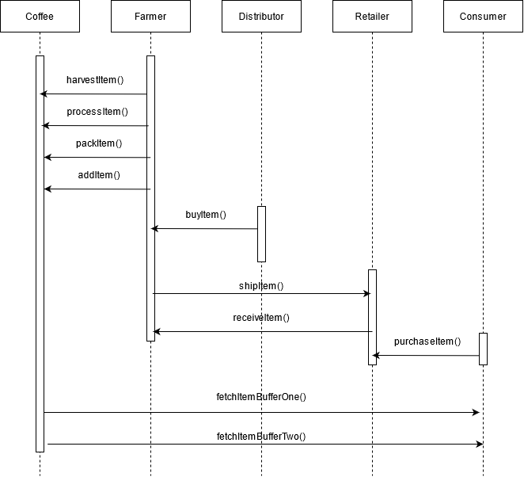
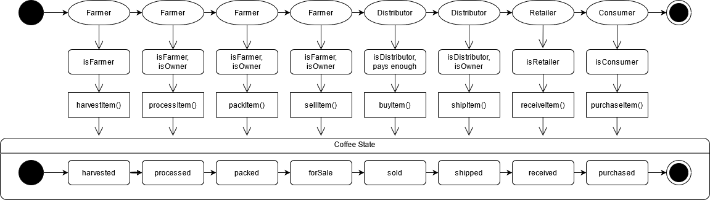
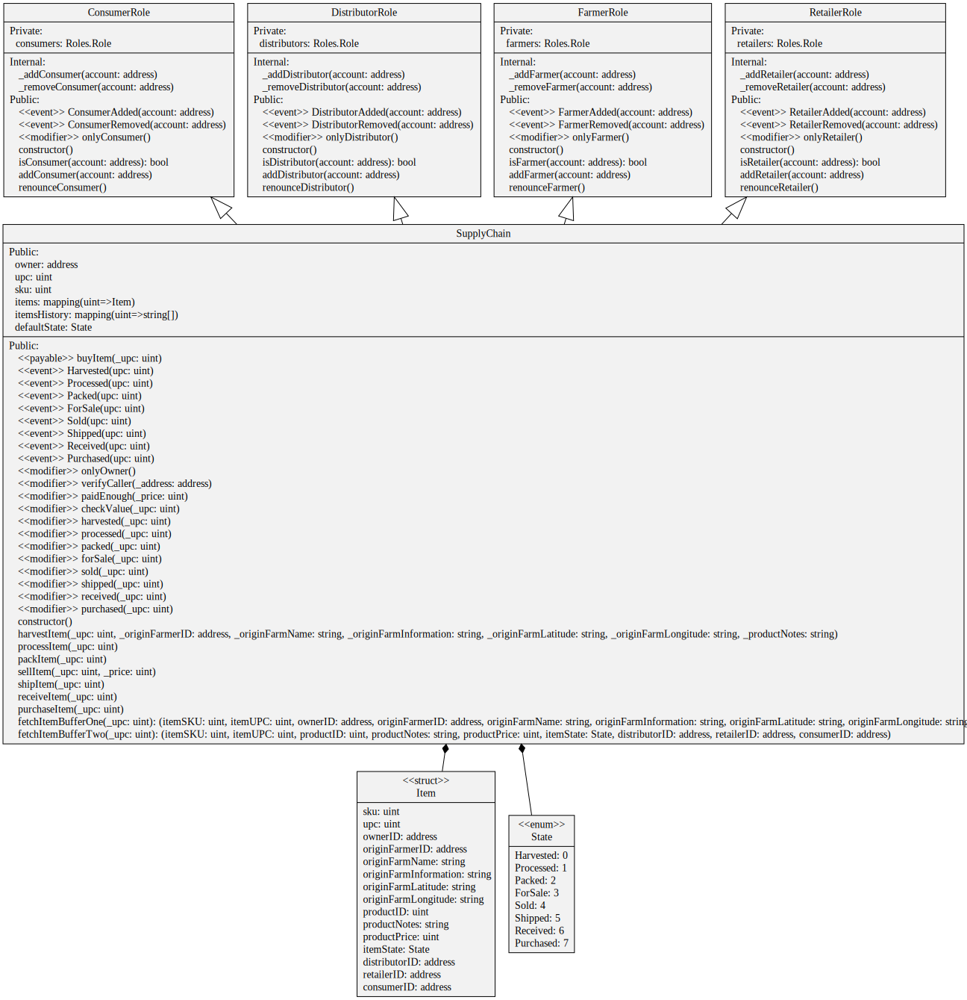

# Main Product

## UML

### Sequence Diagram



### State Diagram



### Class Diagram



## Libraries

### Truffle

Truffle is a development environment, testing framework and asset pipeline for Ethereum, aiming to make life as an Ethereum developer easier. 
It provides direct ways to :

- compile, test and deploy smart contracts
- inject jsonAbi into a front-end
- manage different networks
- use a development environment in a console with a local blockchain provided by ganache

### web3js

This library is basically the go-to library for front-end smart contract interaction via blockchain nodes. It contains all the functionalities needed to :

- manage connected web3 wallets 
- sign transaction
- submit transactions to the blockchain

### IPFS

IPFS is not used in this project.

## Versions used

```bash
ubuntu_u0@Distributed:~/uda-bd/udabd-p3-SupplyChainCoffee/project-6$ truffle version
Truffle v5.4.7 (core: 5.4.7)
Solidity v0.5.16 (solc-js)
Node v16.5.0
Web3.js v1.5.2
```

## Rinkeby deployment

```
contract address : 0xf8d563948c0011eac601a01a24e9a40e95bc6786
contract creation transaction : 0x417715d47b8c9ab0c942910bc27a29e8f1ca1daeb439297675ebf91ed5f498bb
```

contract address <https://rinkeby.etherscan.io/address/0xf8d563948c0011eac601a01a24e9a40e95bc6786>
contract creation transaction <https://rinkeby.etherscan.io/tx/0x417715d47b8c9ab0c942910bc27a29e8f1ca1daeb439297675ebf91ed5f498bb>

# Supply chain & data auditing

This repository containts an Ethereum DApp that demonstrates a Supply Chain flow between a Seller and Buyer. The user story is similar to any commonly used supply chain process. A Seller can add items to the inventory system stored in the blockchain. A Buyer can purchase such items from the inventory system. Additionally a Seller can mark an item as Shipped, and similarly a Buyer can mark an item as Received.

The DApp User Interface when running should look like...


## Getting Started

These instructions will get you a copy of the project up and running on your local machine for development and testing purposes. See deployment for notes on how to deploy the project on a live system.

### Prerequisites

Please make sure you've already installed ganache-cli, Truffle and enabled MetaMask extension in your browser.

```
Give examples (to be clarified)
```

### Installing

> The starter code is written for **Solidity v0.4.24**. At the time of writing, the current Truffle v5 comes with Solidity v0.5 that requires function *mutability* and *visibility* to be specified (please refer to Solidity [documentation](https://docs.soliditylang.org/en/v0.5.0/050-breaking-changes.html) for more details). To use this starter code, please run `npm i -g truffle@4.1.14` to install Truffle v4 with Solidity v0.4.24. 

A step by step series of examples that tell you have to get a development env running

Clone this repository:

```
git clone https://github.com/udacity/nd1309/tree/master/course-5/project-6
```

Change directory to ```project-6``` folder and install all requisite npm packages (as listed in ```package.json```):

```
cd project-6
npm install
```

Launch Ganache:

```
ganache-cli -m "spirit supply whale amount human item harsh scare congress discover talent hamster"
```

Your terminal should look something like this:


In a separate terminal window, Compile smart contracts:

```
truffle compile
```

Your terminal should look something like this:


This will create the smart contract artifacts in folder ```build\contracts```.

Migrate smart contracts to the locally running blockchain, ganache-cli:

```
truffle migrate
```

Your terminal should look something like this:


Test smart contracts:

```
truffle test
```

All 10 tests should pass.


In a separate terminal window, launch the DApp:

```
npm run dev
```

## Built With

* [Ethereum](https://www.ethereum.org/) - Ethereum is a decentralized platform that runs smart contracts
* [IPFS](https://ipfs.io/) - IPFS is the Distributed Web | A peer-to-peer hypermedia protocol
to make the web faster, safer, and more open.
* [Truffle Framework](http://truffleframework.com/) - Truffle is the most popular development framework for Ethereum with a mission to make your life a whole lot easier.


## Authors

See also the list of [contributors](https://github.com/your/project/contributors.md) who participated in this project.

## Acknowledgments

* Solidity
* Ganache-cli
* Truffle
* IPFS
